# Hey there! :wave:

I'm [Ryan](https://ryanmaber.com/), a Lead Full Stack Software Engineer with over 13 years of commercial experience working with fast-growing scale-ups.

## Professional Work :office: :rocket:

Right now, I'm using TypeScript, React, GraphQL, and PHP to build and deploy multiple cloud-native products that support hundreds of clients to help generate almost $2 billion in revenue.

At work I lead across two key product functions:

- The Integrations Team, responsible for one of the key strategic pillars - and in-charge of enabling strong commercial partnerships through first-party integrations with platforms like Meta, Google, Bloomreach, Klaviyo, and Braze.
- The newly-formed Innovation Team, tasked with bringing a breakthrough product to market, and transforming a single-product business into a multi-product suite of trust-driven customer acquisition tools.

## Side Projects & Open Source :house:

Outside of work, you'll often find me experimenting with new technologies and building open-source tools that help engineers - whether that be open-source libraries in Rust, the TypeScript and React frontend for my portfolio, large monorepos in PHP, or cloud infrastructure in Terraform.

### Projects I'm Proud Of

#### Rust

- [aws-cognito-srp](https://github.com/ryanmab/aws-cognito-srp) is a low-level library used by Engineers to integrate directly with AWS Cognito using the [Secure Remote Password protocol](https://en.wikipedia.org/wiki/Secure_Remote_Password_protocol).
- [smvr](https://github.com/ryanmab/smvr) is a small parser for Semantic Version strings - and also my first foray into the Rust programming language.

I also maintain a number of other libraries for the Rust and PHP communities, including API wrappers for Home Automation software and more. You can browse them [here](https://github.com/ryanmab?tab=repositories&language=rust)!

#### SaaS

[Coverage Robot](https://github.com/coverage-robot/core) is a large source-available SaaS platform aimed at solving code coverage analysis at scale, and currently supports more than 14 billion lines of code coverage and terabytes of queries for fast-paced engineering teams.

I built this mostly as a passion project - [born out of frustration with the existing providers](https://ryanmaber.com/article/a-fresh-take-on-code-coverage) - that has grown into a large monorepo running in production.

## Let’s connect :speech_balloon:

I'm always happy to chat! Reach me via [my portfolio](https://www.ryanmaber.com/) or connect on [LinkedIn](https://www.linkedin.com/in/ryan-maber/).

